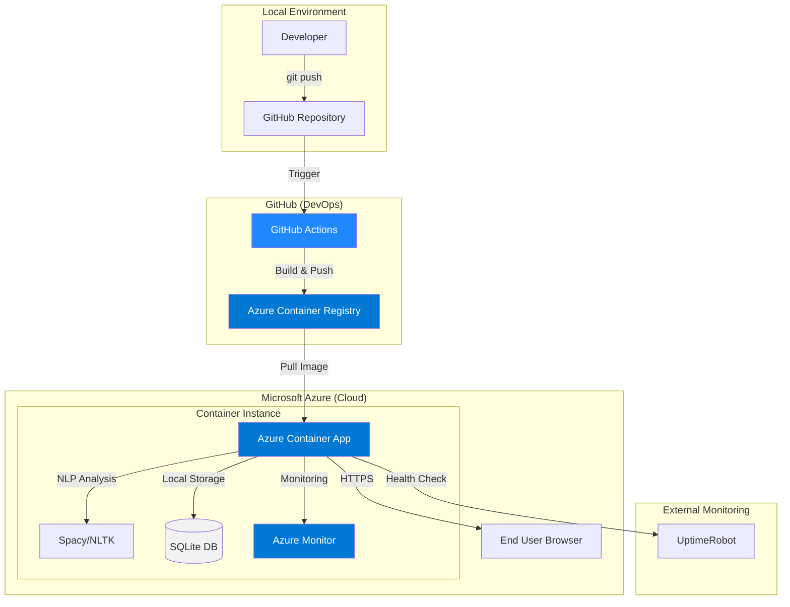

# AI Resume Analyzer — Cloud Deployment Summary

## Project Overview
**Project Title:** AI Resume Analyzer
**Course:** Cloud Computing Technology and Architectures (AI364TA)
**Institution:** RV College of Engineering, Department of AI & ML
**Developer:** Pranav Pratyush

## Cloud Infrastructure
The application is successfully deployed to **Microsoft Azure** using a serverless container architecture. This professional cloud-native stack provides automatic scaling, secure image management, and integrated monitoring.

### Cloud Services Utilized:
*   **Azure Container Apps:** Serverless container hosting platform (Mumbai region).
*   **Azure Container Registry (ACR):** Secure, private Docker image registry.
*   **GitHub Actions:** Fully automated CI/CD pipeline for building and deployment.
*   **Azure Monitor:** Integrated logging and application health tracking.
*   **UptimeRobot:** External availability monitoring.

## Architecture Diagram

## Deployment Process Summary
1.  **Containerization:** The application is containerized using `python:3.9-slim` and optimized for Azure Container Apps.
2.  **Database Migration:** Migrated from MySQL to a serverless-friendly SQLite database (`resume_data.db`) to ensure statelessness across container restarts.
3.  **Secure Registry:** Set up Azure Container Registry (ACR) to securely host project images, decoupled from the hosting environment.
4.  **CI/CD Pipeline:** Configured GitHub Actions to automatically build the Docker image, push it to ACR, and update the Container App on every push to `main`.
5.  **Logging & Monitoring:** Integrated centralized logging via Azure Monitor to track user interactions and system health.

## Challenges Faced & Solutions
*   **Registry Authentication:** Encounted "Unauthorized" errors when pulling images. **Solution:** Configured the Container App with registry credentials via GitHub Secrets to enable secure image retrieval.
*   **Stateless Persistence:** Containers lose data on restart. **Solution:** Implemented a lightweight SQLite database for local persistence while documenting the roadmap for Azure SQL integration.
*   **Port Mapping:** Adjusted Streamlit to listen on port 8000 to match Azure's default ingress expectations for internal routing.

## Production Roadmap (Cloud Best Practices)
To further align with "Acceptable Implementations" for enterprise cloud architectures:
*   **Cloud Database:** Transition from SQLite to **Azure SQL Database** or **Cosmos DB** for managed, persistent, and scalable data storage.
*   **Object Storage:** Migrate local resume storage (`./Uploaded_Resumes`) to **Azure Blob Storage** for durability and accessibility across multiple instances.
*   **Enhanced Security:** Implement **Azure Key Vault** for secret management and **Azure Active Directory (RBAC)** for granular access control.

## Live Demo
**Application URL:** [https://resume-analyzer.blacktree-92a6a33e.centralindia.azurecontainerapps.io/](https://resume-analyzer.blacktree-92a6a33e.centralindia.azurecontainerapps.io/)
